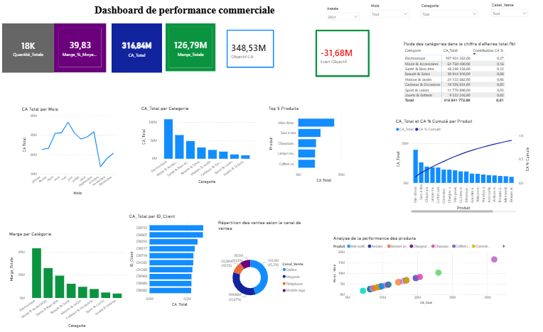

# 📊 Decision Support System for TOFTAL Technologies

> **Business Intelligence Project | Power BI | SQL | CRISP-DM | E-commerce Analytics**

This repository presents the design and implementation of a **Business Intelligence Decision Support System** developed for **TOFTAL Technologies** as part of my Master's Degree in **Business Intelligence & Big Data**.

The project transforms operational e-commerce data into actionable business insights through data modeling, KPI monitoring, interactive dashboards and analytical reporting.

---

## 📷 Executive Dashboard



---

## 📑 Table of Contents

- [Project Overview](#-project-overview)
- [Business Objectives](#-business-objectives)
- [Technologies](#-technologies)
- [Project Documentation](#-project-documentation)
- [Power BI Dashboards](#-power-bi-dashboards)
- [Repository Structure](#-repository-structure)
- [Author](#-author)

---

# 📌 Project Overview

The objective of this project was to design a Business Intelligence solution capable of supporting decision-makers through interactive dashboards and analytical reports.

The solution covers:

- Executive KPI monitoring
- Sales performance analysis
- Product performance analysis
- Customer analytics
- Profitability analysis
- Sales channel analysis
- Promotional performance evaluation

---

# 🎯 Business Objectives

- Centralize commercial data.
- Monitor strategic KPIs.
- Improve business visibility.
- Support data-driven decision-making.
- Identify commercial opportunities.
- Evaluate business performance.

---

# 🛠 Technologies

| Category | Technology |
|----------|------------|
| Business Intelligence | Power BI |
| Database | SQL |
| Data Sources | Shopify, Microsoft Excel |
| Methodology | CRISP-DM |

---

# 📚 Project Documentation

The complete project documentation is available in the `documentation` folder.

| Document | Description |
|----------|-------------|
| Business Context | Business problem and objectives |
| Methodology | CRISP-DM implementation |
| Solution Architecture | Decision Support System architecture |
| Data Model | Description of analytical data model |
| Dashboard Guide | Overview of Power BI dashboards |

---

# 📊 Power BI Dashboards

The project includes several interactive dashboards:

- 🏠 Home Dashboard
- 📦 Products & Customers
- 💰 Profitability Analysis
- 🛒 Sales Channels
- 💬 Custom Tooltip

Each dashboard supports strategic decision-making through interactive visualizations and KPI monitoring.

---

# 📁 Repository Structure

```text
decision-support-system-toftal/

README.md

dashboards/
    executive-dashboard.png

documentation/
    business-context.md
    methodology.md
    architecture.md
    data-model.md
    dashboard-guide.md

images/
    solution-architecture.png
```

---

# 🚀 Future Improvements

Future developments may include:

- Data Warehouse implementation
- Predictive Analytics
- Sales Forecasting
- Machine Learning integration
- Automated dashboard refresh

---

# 👩‍💻 Author

**Combe Sy**

Business Intelligence Analyst | Data Analyst

📍 Dakar, Senegal

🔗 LinkedIn: https://www.linkedin.com/in/combesy

📧 Email: sycombe2019@gmail.com
